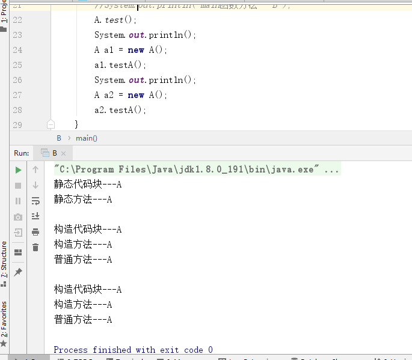

## 概念 ##
**静态代码块**：在java中使用static关键字声明的代码块。静态块用于初始化类，为类的属性初始化。每个静态代码块只会执行一次。由于JVM在加载类时会执行静态代码块，所以静态代码块先于主方法执行。
**构造代码块**：直接在类中定义且没有加static关键字的代码块称为{}构造代码块。构造代码块在创建对象时被调用，每次创建对象都会被调用，并且构造代码块的执行次序优先于类构造函数。
**普通代码块**：在方法或语句中出现的{}就称为普通代码块。普通代码块和一般的语句执行顺序由他们在代码中出现的次序决定--“先出现先执行”
**构造函数**：也称构造器，和类同名，没有返回类型。每个类都有一个默认的构造函数（不带参数），可以不用定义。（void也没有）
**继承**：在一个现有类型的基础上，通过增加新的方法或者重定义已有方法的方式，产生一个新的类型
**重载(overload)**：在同一个类里面两个或者是多个方法的方法名相同但是参数不同
**重写/覆写(override)**：重写也被称为覆写。对一个方法的重写必须发生在具有继承关系的两个类中，即子类对父类方法的重写。它要求两个方法的参数个数和类型以及返回值类型都必须一致，这样才称为方法重写。
<!--more-->
## 分析 ##
A类

	public class A {
	    static{
	        System.out.println("静态代码块---A");
	    }
	    {
	        System.out.println("构造代码块---A");
	    }
	    public  A() {
	        System.out.println("构造方法---A");
	    }
	    public static  void test() {
	        System.out.println("静态方法---A");
	    }
	    public void testA() {
	        System.out.println("普通方法---A");
	    }
	    public static void main(String[] args) {
	        System.out.println("main函数方法---A");
	    }
	}
用另一个类调用下看看：
        
	A.test();
    System.out.println();
    A a1 = new A();
    a1.testA();
    System.out.println();
    A a2 = new A();
    a2.testA();
结果：

由此可见：**每个类的静态代码块只会执行一次，无论你初始化多少次；而构造代码块、构造函数是每初始化一次就执行一次的。**
执行顺序：**静态代码块>构造代码块>构造方法>main方法（构造代码块和构造方法只有在被初始化的时候才会调用）**
再看另一例(延用上面的A类)：

	public class B extends  A {
	    static{
	        System.out.println("静态代码块---B");
	    }
	    {
	        System.out.println("构造代码块---B");
	    }
	    public  B(int i) {
	        System.out.println("带参构造方法---B");
	    }
	    public  B() {
	        System.out.println("无参构造方法---B");
	    }
	    public static void test() {
	        System.out.println("静态方法---B");
	    }
	    public void testB() {
	        System.out.println("不带参普通方法---B");
	    }
	    public void testB(int i) {
	        System.out.println("带参普通方法---B");
	    }

	    public static void main(String[] args) {
	        B b = new B();
	        System.out.println();
	        b = new B(1);
	        System.out.println();
	        b.testB();
	        b.testB(1);
	    }
	}
执行结果：

	静态代码块---A
	静态代码块---B
	构造代码块---A
	无参构造方法---A
	构造代码块---B
	无参构造方法---B
	
	构造代码块---A
	无参构造方法---A
	构造代码块---B
	带参构造方法---B
	
	不带参普通方法---B
	带参普通方法---B
	
	Process finished with exit code 0

说明：
1）子类永远会默认继承父类的默认（不带参）的构造函数，子类每初始化一次，必然会调用一次父类的不带参的默认构造器。
2）当子类和父类都有相同方法声明的函数时，具体调用子类还是父类的方法是看初始化的谁，例如本例中是new B，而与变量类型无关；

所以结论是：
**父类静态代码块-子类静态代码块-父类构造代码块-父类无参构造方法-子类构造代码块-子类无参构造方法**
静态代码只会执行一次，构造代码块、构造函数是每初始化一次就执行一次