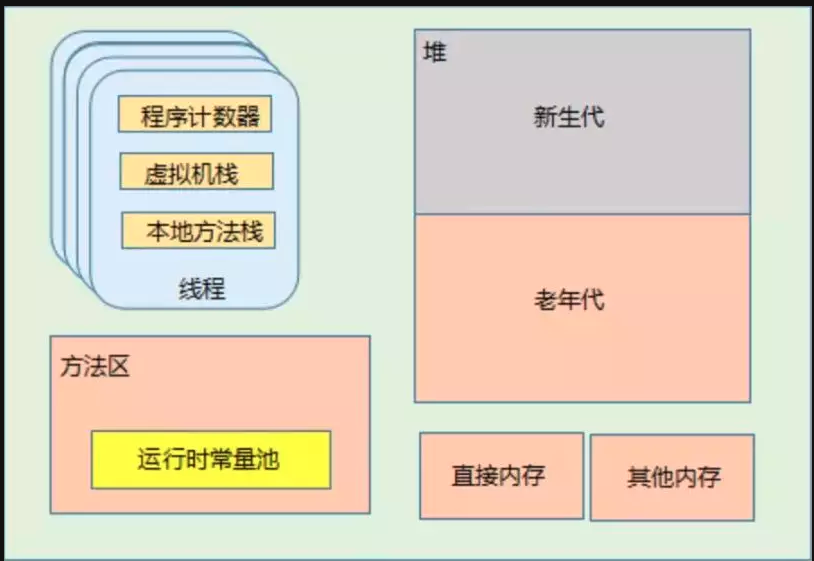

# JVM的内存区域是怎么划分的？ #

下面这张图，反映了运行中的Java进程内存占用情况：

<!--more-->
首先是**程序计数器（Program Counter Register)**，在JVM规范中，每个线程都有自己的程序计数器。这是一块比较小的内存空间，存储当前线程正在执行的Java方法的JVM指令地址，即字节码的行号。如果正在执行Native方法，则这个计数器为空。该内存区域是唯一一个在Java虚拟机规范中没有规定任何OOM情况的内存区域。

第二，**Java虚拟机栈(Java Virtal Machine Stack)**，同样也是属于线程私有区域，每个线程在创建的时候都会创建一个虚拟机栈，生命周期与线程一致，线程退出时，线程的虚拟机栈也回收。虚拟机栈内部保持一个个的栈帧，每次方法调用都会进行压栈，JVM对栈帧的操作只有出栈和压栈两种，方法调用结束时会进行出栈操作。

该区域存储着局部变量表，编译时期可知的各种基本类型数据、对象引用、方法出口等信息。

第三，**本地方法栈（Native Method Stack）**与虚拟机栈类似，本地方法栈是在调用本地方法时使用的栈，每个线程都有一个本地方法栈。

第四，**堆（Heap）**,几乎所有创建的Java对象实例，都是被直接分配到堆上的。堆被所有的线程所共享，在堆上的区域，会被垃圾回收器做进一步划分，例如新生代、老年代的划分。Java虚拟机在启动的时候，可以使用“Xmx”之类的参数指定堆区域的大小。

第五，**方法区（Method Area)**。方法区与堆一样，也是所有的线程所共享，存储被虚拟机加载的元（Meta）数据，包括类信息、常量、静态变量、即时编译器编译后的代码等数据。这里需要注意的是运行时常量池也在方法区中。根据Java虚拟机规范的规定，当方法区无法满足内存分配需求时，将抛出OutOfMemoryError异常。由于早期HotSpot JVM的实现，将CG分代收集拓展到了方法区，因此很多人会将方法区称为永久代。Oracle JDK8中已永久代移除永久代，同时增加了元数据区（Metaspace）。

第六，**运行时常量池（Run-Time Constant Pool)**，这是方法区的一部分，受到方法区内存的限制，当常量池无法再申请到内存时，会抛出OutOfMemoryError异常。

在Class文件中，除了有类的版本、方法、字段、接口等描述信息外，还有一项信息是常量池。每个Class文件的头四个字节称为Magic Number，它的作用是确定这是否是一个可以被虚拟机接受的文件；接着的四个字节存储的是Class文件的版本号。紧挨着版本号之后的，就是常量池入口了。常量池主要存放两大类常量：

  ● 字面量（Literal），如文本字符串、final常量值
  ● 符号引用，存放了与编译相关的一些常量，因为Java不像C++那样有连接的过程，因此字段方法这些符号引用在运行期就需要进行转换，以便得到真正的内存入口地址。

class文件中的常量池，也称为静态常量池，JVM虚拟机完成类装载操作后，会把静态常量池加载到内存中，存放在运行时常量池。

第七，**直接内存（Direct Memory）**，直接内存并不属于Java规范规定的属于Java虚拟机运行时数据区的一部分。Java的NIO可以使用Native方法直接在java堆外分配内存，使用DirectByteBuffer对象作为这个堆外内存的引用。

**OOM可能发生在哪些区域上？**

根据javadoc的描述，OOM是指JVM的内存不够用了，同时垃圾收集器也无法提供更多的内存。从描述中可以看出，在JVM抛出OutOfMemoryError之前，垃圾收集器一般会出马先尝试回收内存。

从上面分析的Java数据区来看，除了程序计数器不会发生OOM外，哪些区域会发生OOM的情况呢？

**第一，堆内存。**堆内存不足是最常见的发送OOM的原因之一，如果在堆中没有内存完成对象实例的分配，并且堆无法再扩展时，将抛出OutOfMemoryError异常。当前主流的JVM可以通过-Xmx和-Xms来控制堆内存的大小，发生堆上OOM的可能是存在内存泄露，也可能是堆大小分配不合理。

**第二，Java虚拟机栈和本地方法栈**，这两个区域的区别不过是虚拟机栈为虚拟机执行Java方法服务，而本地方法栈则为虚拟机使用到的Native方法服务，在内存分配异常上是相同的。在JVM规范中，对Java虚拟机栈规定了两种异常：1.如果线程请求的栈大于所分配的栈大小，则抛出StackOverFlowError错误，比如进行了一个不会停止的递归调用；2. 如果虚拟机栈是可以动态拓展的，拓展时无法申请到足够的内存，则抛出OutOfMemoryError错误。

**第三，直接内存**。直接内存虽然不是虚拟机运行时数据区的一部分，但既然是内存，就会受到物理内存的限制。在JDK1.4中引入的NIO使用Native函数库在堆外内存上直接分配内存，但直接内存不足时，也会导致OOM。

**第四，方法区。**随着Metaspace元数据区的引入，方法区的OOM错误信息也变成了“java.lang.OutOfMemoryError:Metaspace”。对于旧版本的Oracle JDK，由于永久代的大小有限，而JVM对永久代的垃圾回收并不积极，如果往永久代不断写入数据，例如String.Intern()的调用，在永久代占用太多空间导致内存不足，也会出现OOM的问题，对应的错误信为“java.lang.OutOfMemoryError:PermGen space”